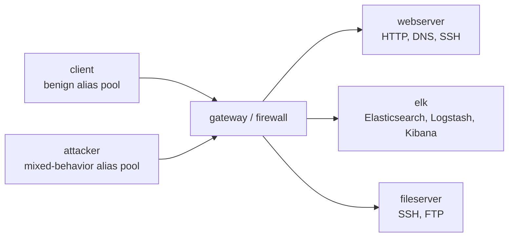

# BlueMon: Enterprise Monitoring, Detection, and Response with ELK

Created for team-based cybersecurity instruction on the SPHERE testbed.

## Contents

1. [How to access](#how-to-access)
2. [Overview](#overview)
3. [Learning objectives](#learning-objectives)
4. [Monitoring team tasks](#monitoring-team-tasks)
5. [Detection team tasks](#detection-team-tasks)
6. [Mitigation team tasks](#mitigation-team-tasks)
7. [Exercise dynamics](#exercise-dynamics)
8. [Scoring](#scoring)
9. [Submission and grading](#submission-and-grading)
10. [Useful links](#useful-links)

## How to access

Use the team XDC and lab name assigned by your instructor. From the XDC terminal, create and configure the complete six-node experiment with:

```bash
startexp elkdefense
runlab elkdefense
```

Wait for each command to complete. If `runlab` appears finished but does not return to the prompt, press Enter once. Then connect to a node by name, for example `ssh elk` or `ssh gateway`. See [Setup and Access](Setup.md) for validation and troubleshooting.

## Overview

Each team receives an isolated enterprise-style network and acts as its security engineering group. The goal is to build an ELK-based monitoring capability, distinguish benign behavior from attacks, measure detection quality, and mitigate malicious behavior without unnecessarily disrupting legitimate activity.



The `client` produces ordinary HTTP, DNS, SSH, and file-transfer activity from changing source addresses. The `attacker` produces a low-rate, repeatable baseline containing port scans, failed SSH logins, and Web reconnaissance, also from changing addresses. Some attacker addresses also generate ordinary-looking requests. Consequently, an address alone is not reliable evidence of malicious intent.

The exercise lasts three weeks:

- **Week 1 — Monitoring:** deploy ELK, instrument the network, validate data quality, and characterize benign traffic.
- **Week 2 — Detection:** investigate the supplied baseline, design additional attacks, implement detections, and measure their quality.
- **Week 3 — Mitigation:** deploy behavior-based controls, validate that attacks are reduced, and demonstrate that legitimate service remains available.

## Learning objectives

In this three-week team assignment, you will operate a small enterprise network on the SPHERE testbed. You will build an ELK-based security monitoring system, distinguish benign activity from attacks, create behavior-based detections, and mitigate malicious activity without unnecessarily disrupting legitimate users.

By the end of the assignment, you should be able to:

1. deploy Elasticsearch, Logstash, and Kibana on a multi-node network;
2. collect and normalize host, service, authentication, and network telemetry;
3. build Kibana dashboards that support an investigation;
4. design repeatable attacks and document their observable evidence;
5. write and evaluate detections using measurable ground truth;
6. enforce and test firewall or access-control mitigations;
7. use an AI assistant critically, with verification and an auditable record; and
8. explain your own technical contribution to a team system.

## Monitoring team tasks

Deploy Elasticsearch, Logstash, and Kibana; collect host, service, authentication, and gateway telemetry; validate fields and timestamps; and build service-health and security dashboards. See [Week 1 tasks](Tasks.md#week-1--monitoring-setup).

## Detection team tasks

Characterize legitimate activity before examining labels, investigate the supplied attack baseline, create three additional bounded scenarios, implement at least five detections, and measure precision, recall, and F1 against ground truth. See [Week 2 tasks](Tasks.md#week-2--detection-and-investigation).

## Mitigation team tasks

Design reviewed and reversible controls, implement behavior-based response that handles changing aliases, and conduct a controlled before/after evaluation that includes legitimate-service checks. A permanent block of the attacker subnet does not qualify. See [Week 3 tasks](Tasks.md#week-3--mitigation-and-validation).

## Exercise dynamics

Teams contain six to eight students. Assign a primary owner and reviewer for platform, telemetry, benign traffic, adversary emulation, detection, response, and validation work. Automation supplies a common traffic baseline; students must create and explain additional attacks, detections, and mitigations. AI assistance is permitted when documented, reviewed, and experimentally verified.

All activity must remain inside the assigned SPHERE experiment. Do not target the XDC, SPHERE infrastructure, another team, or the public Internet. Denial of service, destructive payloads, persistence, and resource exhaustion are outside scope.

## Scoring

Teams earn credit for observable and reproducible engineering outcomes: reliable telemetry, useful dashboards, explainable detections, measured detection quality, effective mitigations, and continued legitimate service. Raw alert volume, indiscriminate blocking, or simply running supplied or AI-generated code does not demonstrate success.

## Submission and grading

The assignment is graded out of 100 points across reproducible ELK deployment, telemetry quality, dashboards, student-designed attacks, detection engineering and evaluation, mitigation, availability, documentation, and individual contribution. See [Submission and Grading](Grading.md) for deliverables, the rubric, and automatic caps.

## Start here

1. Read [Introduction and Rules](Introduction.md).
2. Follow [Setup and Access](Setup.md) to create the entire topology with one SPHERE command.
3. Complete [Tasks and Milestones](Tasks.md).
4. Review [AI Use and Evidence](AI-Use.md) before using an AI assistant.
5. Review [Submission and Grading](Grading.md) before beginning.

Instructors should follow [SPHERE Smoke Test](SMOKE-TEST.md) before releasing the lab.

## Repository map

```text
.
├── README.md
├── Introduction.md
├── Setup.md
├── Tasks.md
├── AI-Use.md
├── Grading.md
├── Instructor-Guide.md
└── sphere/
    ├── elkdefense.model
    ├── nodes
    └── <node>/
```

## Useful links

- [SPHERE class accounts and assignments](https://mergetb.gitlab.io/testbeds/sphere/sphere-docs/docs/experimentation/classes/)
- [SPHERE experiment model reference](https://mergetb.gitlab.io/testbeds/sphere/sphere-docs/docs/experimentation/model-ref/)
- [Elastic documentation](https://www.elastic.co/guide/)
- [MITRE ATT&CK Enterprise](https://attack.mitre.org/)
